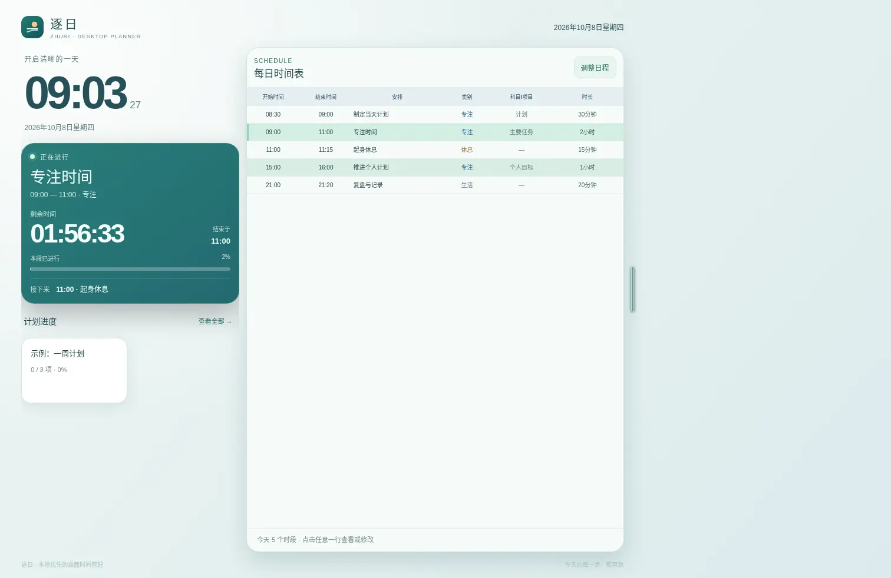
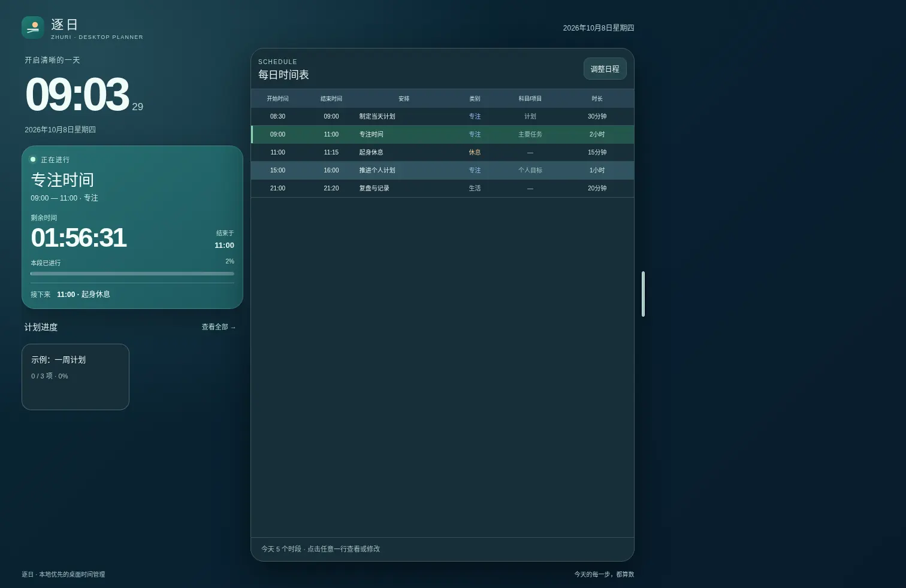
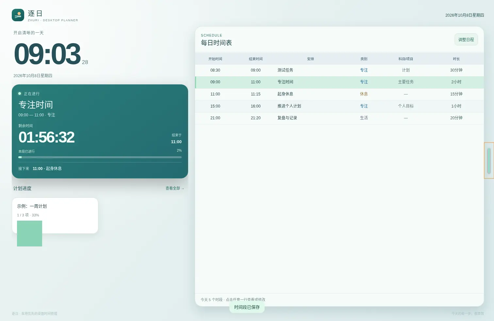

# 逐日 ZhuRi

**让时间规划成为你的桌面壁纸。**

逐日（ZhuRi）是一款免费开源的**可交互式桌面壁纸**。它把每日时间安排、当前任务、实时倒计时和计划进度直接放到 macOS 桌面背景上：不用反复打开日程软件，回到桌面就能看见现在该做什么、还剩多久、下一项是什么。

通过 [Plash](https://sindresorhus.com/plash)，逐日将网页呈现为 **Mac 桌面壁纸**。平时像壁纸一样安静显示；需要调整计划或完成任务时，开启 Plash 的 **Browsing Mode（浏览模式）**，就能直接与桌面卡片交互。你也可以在普通浏览器中使用。



**这是一张会显示你的计划、也能由你亲手修改的壁纸。**

## 🌿 壁纸能做什么？

- **把日程放在桌面上**：显示当天六列时间表——开始时间、结束时间、安排、类别、科目/项目、时长；支持按星期重复和跨午夜安排。
- **实时感知当前时段**：当前任务、按秒更新的剩余时间、时段进度条与下一项安排一眼可见。
- **直接与壁纸交互**：在同一张卡片内查看计划、阶段和任务，打卡或修改内容；桌面整体布局不跳转。
- **给桌面图标留位置**：拖动右侧细胶囊，自由调整壁纸面板宽度，为 Finder 文件图标保留空间。
- **融入 macOS**：自动跟随系统深色/浅色外观；根据屏幕可用宽度自适应，适配不同尺寸的 MacBook 与外接显示器。
- **计划自由定义**：创建自己的日程、项目、阶段与任务，不需要修改源代码。
- **数据由你保管**：默认保存在当前浏览器本地，支持 JSON 导出与导入，无需账号。
- **本地或在线部署**：在 Mac 本地运行可离线使用；也可以在**自己的 GitHub 仓库**通过 Pages 发布壁纸网址。

## 🖥 桌面效果

| 亮色壁纸 | 暗色壁纸 |
|---|---|
|  |  |



> **如何点击桌面壁纸？** Plash 正常模式用于显示壁纸；需要点击时间表、打卡或拖动胶囊时，在 Plash 菜单中开启 **Browsing Mode**。操作完成后关闭它，即可继续使用 Finder 桌面文件。

## 🚀 新手安装：从零开始

**没有接触过代码也能安装。** 下面每份中文教程都包含软件下载、菜单操作、可复制的终端命令和常见问题。

| 你想做什么 | 从这里开始 | 联网要求 |
|---|---|---|
| **推荐：把逐日设为 Mac 桌面壁纸，支持断网使用** | [① 本地离线部署：下载源码、安装 Python 和 Plash、设为桌面、登录自启](docs/01-mac-local.md) | 初次下载安装需要网络；运行时无需互联网 |
| **用自己的 GitHub Pages 发布壁纸网页** | [② 在线部署：Fork 到你自己的账号、开启 Pages、添加到 Plash](docs/02-github-pages.md) | 首次加载需要网络；Plash 离线重启表现未全面验证 |
| **第一次打开，不知道怎么添加内容** | [③ 使用教程：时间表、计划、任务打卡、桌面交互](docs/03-how-to-use.md) | 无需联网 |
| **遇到网页、Plash 或终端问题** | [④ 常见问题排查](docs/04-troubleshooting.md) | 视问题而定 |
| **备份、恢复或迁移计划** | [⑤ 数据与隐私](docs/05-data-and-privacy.md) | 无需联网 |
| **MacBook 尺寸和缩放适配** | [⑥ 屏幕自适应说明](docs/06-screen-support.md) | 无需联网 |

### 获取项目源码

在本仓库右上方点击绿色 **Code** → **Download ZIP**，解压后保留整个文件夹（包括 `index.html`、`src/`、`assets/`、`scripts/`）。随后按照 [本地部署教程](docs/01-mac-local.md)操作。**Plash 需要可访问的网址**；不要只把 HTML 文件直接拖进 Plash。

### 两种使用方式

**A. 本地离线桌面壁纸（推荐）：** 在自己的 Mac 启动本地 HTTP 服务，让 Plash 加载 `http://127.0.0.1:8765/`。服务和网页在本机运行，不依赖互联网；详细命令、软件安装和开机自启见[教程①](docs/01-mac-local.md)。

**B. GitHub Pages 在线桌面壁纸：** 使用者把这个开源项目 Fork 到**自己的 GitHub 账号**，在自己仓库的 **Settings → Pages** 开启发布，然后把**自己的网站地址**添加到 Plash。每个人独立发布、独立使用；详细步骤见[教程②](docs/02-github-pages.md)。

> GitHub Pages 可公开提供网页代码，但你在网页中填写的时间表默认存于当前浏览器的 `localStorage`，**不会自动提交到任何 GitHub 仓库**。请不要把个人 JSON 备份上传到公开仓库。

## 🧩 项目结构

```text
zhu-ri-open/
├── index.html                        壁纸网页入口
├── src/
│   ├── style.css                     壁纸样式与系统深浅色
│   ├── adaptive.css                  Mac 屏幕与留白区域自适应
│   └── app.js                        日程、实时倒计时、任务交互与本地存储
├── assets/                           图标、壁纸预览
├── docs/                             六篇中文安装与使用教程
├── scripts/
│   ├── run-local.command             本地服务启动脚本
│   ├── install-mac-launch-agent.sh   登录时自动运行本地服务
│   └── uninstall-mac-launch-agent.sh 停止自动启动
├── sw.js                             在线网页的基础离线资源缓存
├── manifest.webmanifest              网页应用信息
├── tests/                            静态检查与浏览器测试
├── .github/workflows/check.yml       GitHub Actions 自动检查
├── README_EN.md                      English overview
├── LICENSE                           MIT 开源许可证
└── SECURITY.md                       安全与隐私说明
```

## ℹ️ 使用须知

- **Plash 是第三方 macOS 应用**，需要自行下载安装。逐日提供的是可作为壁纸显示的网页，不会主动接管 macOS 桌面文件。
- **本地模式**使用 `127.0.0.1` 本机服务；若关闭该服务，Plash 无法重新加载对应网址。开机自动启动方法见[教程①](docs/01-mac-local.md)。
- **在线模式**的基础缓存不等于所有 Plash 版本均支持离线重启；需要稳定离线显示时，优先选择本地部署。
- **浏览器存储不自动同步**：Safari、Plash、不同网址可能使用不同存储空间。换设备、切换网址或清理缓存前，请导出 JSON 备份。
- 倒计时在网页运行时更新，不提供 macOS 系统通知或后台提醒。

## 🤝 贡献与许可证

逐日采用 [MIT License](LICENSE) 开源。欢迎通过 [Issues](https://github.com/12668426/zhu-ri-open/issues) 反馈壁纸体验、Plash 兼容性问题与改进建议，参与开发见 [CONTRIBUTING.md](CONTRIBUTING.md)。

开发者可以运行：

```bash
node --check src/app.js
node tests/static-check.mjs
python3 tests/smoke.py
```

普通用户不需要这些开发命令也能安装使用。自动化布局测试不等于已验证所有 MacBook/Plash 组合，详情见[屏幕适配教程](docs/06-screen-support.md)。
